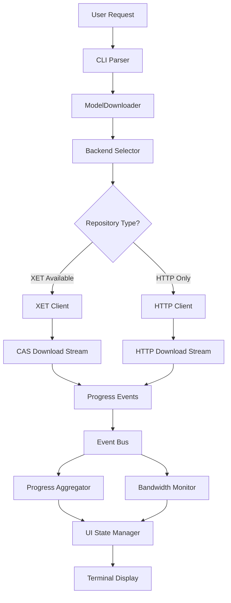
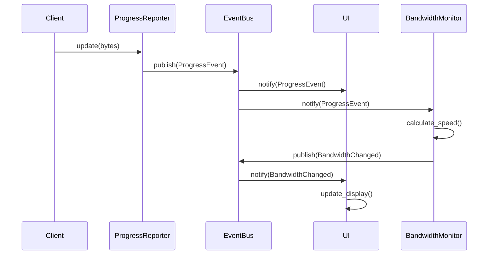

# ProgressHub Data Flow

## Download Request Flow



## Progress Event Flow



## Component Communication

### 1. Download Initiation
```
CLI Arguments
    |
    v
ModelDownloader::new()
    .model("gpt2")
    .download()
    |
    v
Backend Selector
    |
    +--> Check repository metadata
    +--> Determine optimal backend
    +--> Initialize client
```

### 2. Progress Tracking
```
Download Client
    |
    v
Chunk Received
    |
    v
ProgressReporter::update()
    |
    v
ProgressEvent {
    model_id: String,
    file_name: String,
    bytes_downloaded: u64,
    total_bytes: u64,
    download_speed: f64,
}
    |
    v
Event Bus (broadcast)
    |
    +--> UI Subscriber
    +--> Bandwidth Monitor
    +--> Logging System
```

### 3. UI Updates
```
Event Bus
    |
    v
UI Event Handler
    |
    v
State Update {
    - Update model progress
    - Calculate overall progress
    - Update bandwidth graph
}
    |
    v
Render Frame
    |
    v
Terminal Display
```

## Concurrency Model

### Download Tasks
- Each model download runs in its own Tokio task
- Downloads are rate-limited by permits system
- Backpressure prevents memory overflow

### Event Processing
- Event bus uses lock-free channels (flume)
- UI runs in separate task from downloads
- Bandwidth monitoring in dedicated task

### State Management
- Arc<Mutex<_>> for shared state
- Copy-on-write for UI state snapshots
- Atomic updates for progress counters

## Cache Integration

### XET Cache Flow
```
Download Request
    |
    v
Check XET Cache
    |
    +--> Hit: Read from cache
    |
    +--> Miss: Download from remote
              |
              v
              Write to cache
              |
              v
              Serve to user
```

### HuggingFace Cache Structure
```
$HF_HOME/
├── hub/              # Standard HF cache
│   └── models--{org}--{model}/
│       ├── blobs/
│       ├── refs/
│       └── snapshots/
└── xet/              # XET-specific cache
    └── chunks/
```

## Error Handling Flow

```
Download Error
    |
    v
Retry Logic
    |
    +--> Retry with backoff
    |
    +--> Max retries exceeded
         |
         v
         Fallback to HTTP
         |
         +--> Success: Continue
         |
         +--> Failure: Report error
                       |
                       v
                       UI Error Display
```

## Performance Optimizations

1. **Streaming Downloads**: Data flows directly from network to disk
2. **Chunk-based Processing**: Fixed memory usage regardless of file size
3. **Parallel Downloads**: Multiple files download concurrently
4. **Event Batching**: UI updates are throttled to prevent flooding
5. **Zero-Copy Transfers**: Where possible, data is not copied unnecessarily